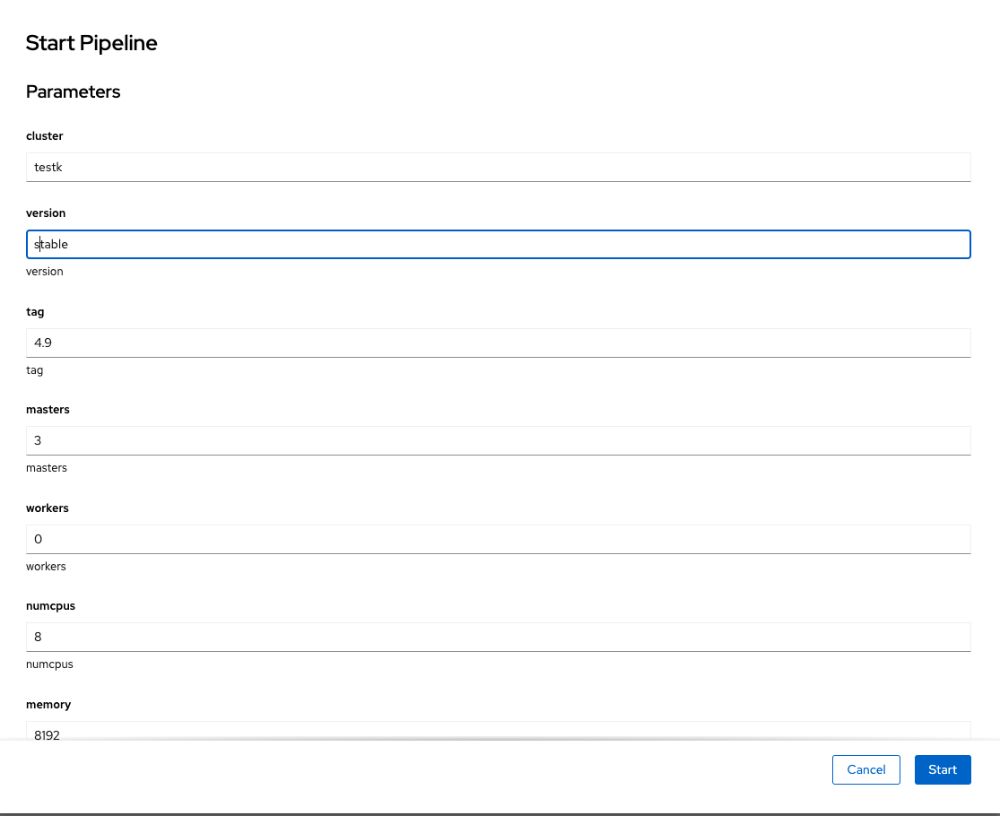
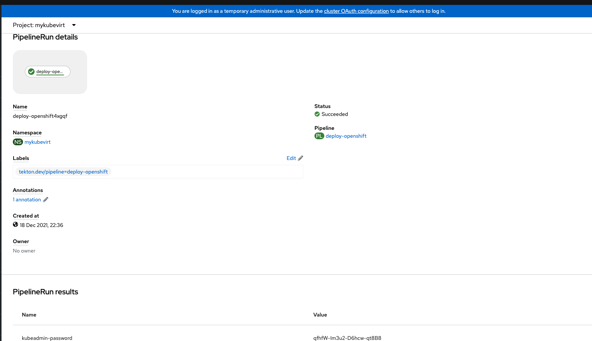
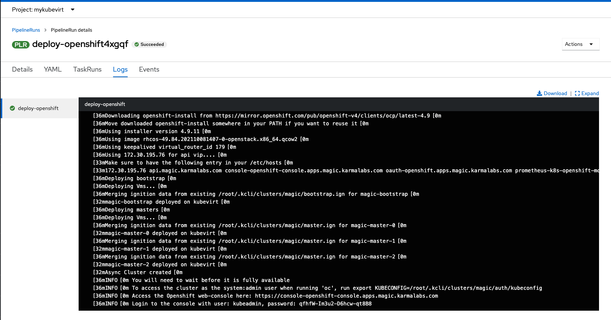

This repo contains assets to ease deploying openshift on openshift using kubevirt vms through a tekton pipeline

# Requisites

- openshift cluster (with admin creds)
- openshift pipelines and virtualization deployed
- storage in place

# Configuration

```
PROJECT=myproject
oc new-project $PROJECT
oc adm policy add-cluster-role-to-user cluster-admin -z pipeline -n $PROJECT
oc adm policy add-scc-to-user anyuid -z pipeline
mkdir /tmp/creds
cp ~/.ssh/*pub /tmp/creds
cp openshift_pull.json /tmp/creds
oc create configmap credentials --from-file=/tmp/creds
rm -rf /tmp/creds
oc create -f pipeline.yml
```

# Launch a deployment

```
oc create -f pipelinerun.yml
```

# Retrieve credentials

```
KUBEADMIN_PASSWORD=$(oc get $(oc get pipelinerun -o name | head -1) -o jsonpath='{.status.pipelineResults[0].value}')
echo $KUBEADMIN_PASSWORD
```

# Screenshots








